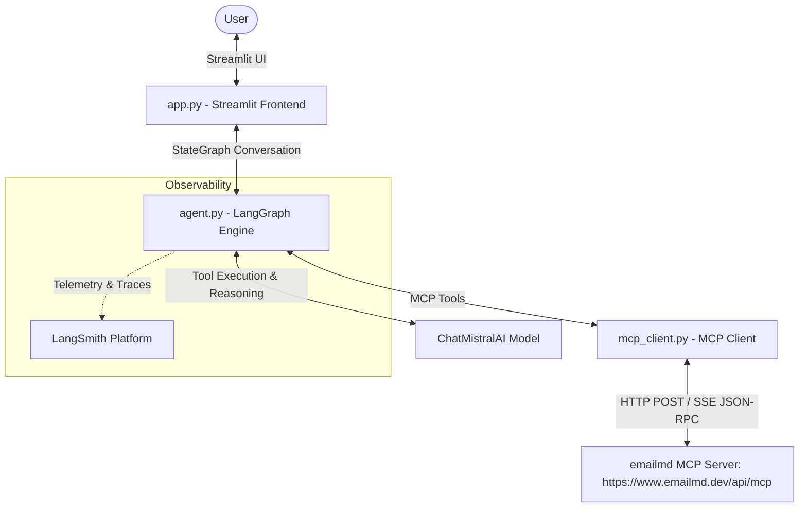

# 📧 emailmd AI Assistant & MCP Client Chatbot

A full-featured, interactive AI Chatbot built using **LangChain**, **LangGraph**, **LangSmith**, **ChatMistralAI**, and **Streamlit**. The chatbot operates as a **Model Context Protocol (MCP) Client** connected over HTTP POST/SSE transport to the remote **`emailmd`** MCP server (`https://www.emailmd.dev/api/mcp`).

---

## 🌟 Overview & Features

`emailmd` is a tool that converts markdown into responsive, email-safe HTML compatible across Gmail, Outlook, Apple Mail, and other major email clients. This AI Chatbot acts as an intelligent email design assistant that can write, lint, format, and render emails interactively.

### Key Features

- **🌐 MCP Client Integration**: Dynamically connects to `https://www.emailmd.dev/api/mcp` over HTTP/POST SSE JSON-RPC transport and loads native MCP tools into LangChain `StructuredTool` instances.
- **⚡ LangGraph Agent Engine**: Powered by a compiled `StateGraph` state-machine with memory checkpointer (`MemorySaver`), multi-turn context retention, and strict tool-call ID sanitization for Mistral AI compatibility.
- **🤖 Powered by Mistral AI**: Utilizes `ChatMistralAI` (`mistral-small-latest` default) for ultra-fast, intelligent reasoning and function calling.
- **📊 LangSmith Observability**: Real-time tracing of intermediate reasoning steps, tool calls, and LLM completions via LangSmith telemetry.
- **👁️ Live Email HTML Preview Tab**: Renders full email-safe HTML and embeds live preview URLs directly inside Streamlit using interactive iframes and component cards.
- **🎨 Glassmorphic Dark Dashboard**: Sleek UI styling with collapsible tool call cards, status indicators, and sidebar settings.

---

## 🏗️ Architecture



---

## 🛠️ Discovered MCP Tools

The chatbot automatically fetches and exposes 3 MCP tools from `https://www.emailmd.dev/api/mcp`:

| Tool | Function | Description |
| :--- | :--- | :--- |
| **`read_docs`** | `read_docs(page=None)` | Fetches official documentation from `emailmd.dev` (e.g. `hero`, `columns`, `buttons`, `callout`, `frontmatter`, `theme`). |
| **`lint`** | `lint(markdown=...)` | Audits email markdown for deliverability, accessibility, generic link text, spam words, or Gmail's 102KB clip limit without rendering. |
| **`render`** | `render(markdown=...)` | Compiles markdown into email-safe HTML, plain-text MIME content, and generates a live browser `previewUrl`. |

---

## 📁 Directory Structure

```
ChatBot/
├── .env                # API keys and environment variables (ignored in git)
├── .env.example        # Environment variable template
├── app.py              # Main Streamlit web application & UI tabs
├── agent.py            # LangGraph StateGraph agent engine & Mistral AI setup
├── mcp_client.py       # MCP Client transport & LangChain tool conversion
├── requirements.txt    # Python package dependencies
└── README.md           # Detailed ChatBot documentation
```

---

## 🚀 Setup & Execution Guide

### 1. Prerequisites
- Python **3.10+** (Python 3.13 recommended)
- A Mistral AI API Key ([Get one here](https://console.mistral.ai/))

### 2. Install Dependencies
```zsh
cd ChatBot
pip install -r requirements.txt
```

### 3. Environment Configuration
Create or edit your `.env` file in `ChatBot/`:
```env
MISTRAL_API_KEY=your_mistral_api_key_here
MCP_SERVER_URL=https://www.emailmd.dev/api/mcp
LANGCHAIN_PROJECT=emailmd-mcp-chatbot

# Optional LangSmith Tracing
LANGCHAIN_API_KEY=your_langsmith_api_key_here
LANGCHAIN_TRACING_V2=true
```

### 4. Launch the Streamlit App
Run the following command:
```zsh
streamlit run app.py
```
Open **`http://localhost:8501`** (or the port indicated in your terminal) to start chatting!

---

## 💡 Example Queries to Ask

- **Generate & Render**:
  > *"Draft a welcome email for an AI newsletter called 'AI Insights'. Include a hero image, 2-column features, and a subscribe button. Lint it and render it for me."*

- **Documentation Lookup**:
  > *"Read the documentation for emailmd hero and column directives using your read_docs tool."*

- **Deliverability Audit**:
  > *"Check this markdown using lint: `# Special Offer! Click [here](http://test.com) to claim free rewards now!`"*

---

## 🛡️ License & Acknowledgments

- Powered by **[emailmd](https://www.emailmd.dev)**
- Standardized using **[Model Context Protocol (MCP)](https://modelcontextprotocol.io)**
- Built with **[LangChain](https://github.com/langchain-ai/langchain)** & **[LangGraph](https://github.com/langchain-ai/langgraph)**
