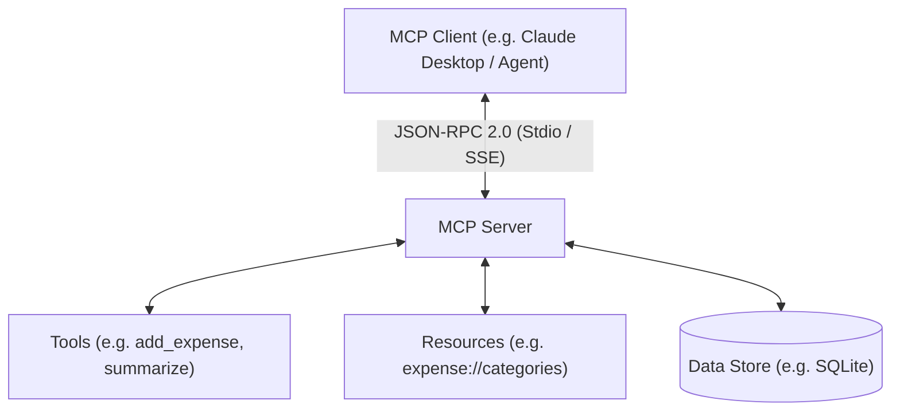

# Model Context Protocol (MCP) Servers Repository

An open repository housing Model Context Protocol (MCP) servers and tools, connecting AI models securely to data sources and execution environments.

---

## 🌐 Overview

The **Model Context Protocol (MCP)** defines an open standard for client applications (like Claude Desktop, Cursor, or AI agent hosts) to discover and interact with external data sources (Resources), actionable functions (Tools), and pre-built templates (Prompts).



---

## 📦 Projects & Included Servers

### 1. 💳 [Expense Tracker MCP Server](file:///Users/shlokbam/Documents/Code/MCP%20%28Model%20Context%20Protocol%29/Expense_Tracker_MCP_Server/README.md) (`Expense_Tracker_MCP_Server`)
A production-ready Python MCP server built using **FastMCP** and **SQLite** for tracking, listing, and summarizing personal/business expenses.

- **Stack**: Python 3.14+, FastMCP (v3.4.7+), SQLite, `uv`.
- **Database**: Auto-initialized SQLite database ([`expenses.db`](file:///Users/shlokbam/Documents/Code/MCP%20%28Model%20Context%20Protocol%29/Expense_Tracker_MCP_Server/main.py)).
- **Category Taxonomy**: Dynamic 20-category schema configured in [`categories.json`](file:///Users/shlokbam/Documents/Code/MCP%20%28Model%20Context%20Protocol%29/Expense_Tracker_MCP_Server/categories.json).
- **Tools**:
  - `add_expense`: Log a new expense entry (`date`, `amount`, `category`, `subcategory`, `note`).
  - `list_expenses`: Retrieve expense records within an inclusive date range.
  - `summarize`: Calculate category totals with optional category filtering.
- **Resources**:
  - `expense://categories`: Returns real-time JSON taxonomy of valid expense categories and subcategories.

---

## 🚀 Quick Start Guide

### Prerequisites
- [uv](https://github.com/astral-sh/uv) (Fast Python package installer and virtualenv manager)
- Python >= 3.14

### Running the Expense Tracker MCP Server

1. Navigate to the project directory:
   ```zsh
   cd "Expense_Tracker_MCP_Server"
   ```

2. **Launch Interactive Dev Inspector**:
   ```zsh
   uv run fastmcp dev inspector main.py
   ```

3. **Run for Client Integration (Stdio)**:
   ```zsh
   uv run python main.py
   ```

---

## 🛠️ Connecting to MCP Clients

To register the Expense Tracker MCP server with an MCP client (such as Claude Desktop or Cursor), add the following entry to your MCP configuration file (`claude_desktop_config.json`):

```json
{
  "mcpServers": {
    "expense-tracker": {
      "command": "uv",
      "args": [
        "--directory",
        "/Users/shlokbam/Documents/Code/MCP (Model Context Protocol)/Expense_Tracker_MCP_Server",
        "run",
        "main.py"
      ]
    }
  }
}
```

---

## 📖 Reference & Documentation

- [Official MCP Specification](https://modelcontextprotocol.io)
- [FastMCP GitHub Repository](https://github.com/jlowin/fastmcp)
- [Expense Tracker Server Detailed README](file:///Users/shlokbam/Documents/Code/MCP%20%28Model%20Context%20Protocol%29/Expense_Tracker_MCP_Server/README.md)
