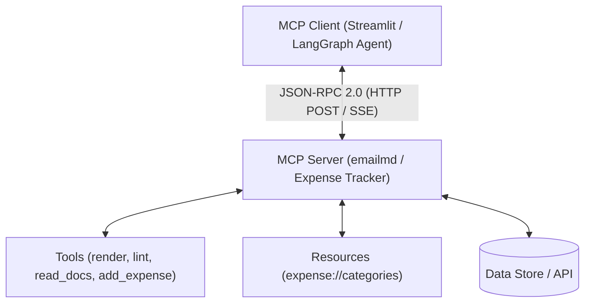

# Model Context Protocol (MCP) Workspace & Client Repository

An open repository housing Model Context Protocol (MCP) servers, tools, and client applications connecting AI models securely to data sources and execution environments.

---

## 🌐 Overview

The **Model Context Protocol (MCP)** defines an open standard for client applications (like Claude Desktop, Cursor, or Streamlit AI agents) to discover and interact with external data sources (Resources), actionable functions (Tools), and pre-built templates (Prompts).



---

## 📦 Projects & Included Applications

### 1. 🤖 [emailmd AI Assistant & MCP Client Chatbot](file:///Users/shlokbam/Documents/Code/MCP%20%28Model%20Context%20Protocol%29/ChatBot/README.md) (`ChatBot`)
A full-stack interactive AI Chatbot and **MCP Client** built with **LangChain**, **LangGraph**, **LangSmith**, **ChatMistralAI**, and **Streamlit**.

- **Connected Server**: [`https://www.emailmd.dev/api/mcp`](https://www.emailmd.dev/api/mcp)
- **Stack**: Python 3.13, LangChain, LangGraph, LangSmith, ChatMistralAI, Streamlit, MCP Python SDK.
- **Discovered Tools**: `render`, `lint`, `read_docs`.
- **Features**: Live HTML email preview iframe tab, multi-turn conversation memory, intermediate tool call execution cards, and LangSmith telemetry.
- **Quick Start**:
  ```zsh
  cd ChatBot
  streamlit run app.py
  ```

### 2. 💳 [Expense Tracker MCP Server](file:///Users/shlokbam/Documents/Code/MCP%20%28Model%20Context%20Protocol%29/Expense_Tracker_MCP_Server/README.md) (`Expense_Tracker_MCP_Server`)
A production-ready Python MCP server built using **FastMCP** and **SQLite** for tracking, listing, and summarizing personal/business expenses.

- **Stack**: Python 3.14+, FastMCP (v3.4.7+), SQLite, `uv`.
- **Database**: Auto-initialized SQLite database ([`expenses.db`](file:///Users/shlokbam/Documents/Code/MCP%20%28Model%20Context%20Protocol%29/Expense_Tracker_MCP_Server/main.py)).
- **Category Taxonomy**: Dynamic 20-category schema configured in [`categories.json`](file:///Users/shlokbam/Documents/Code/MCP%20%28Model%20Context%20Protocol%29/Expense_Tracker_MCP_Server/categories.json).
- **Tools**: `add_expense`, `list_expenses`, `summarize`.
- **Resources**: `expense://categories`.

### 3. 🌐 [Remote Expense Tracker MCP Server](file:///Users/shlokbam/Documents/Code/MCP%20%28Model%20Context%20Protocol%29/Remote_Server/README.md) (`Remote_Server`)
A cloud-deployed async HTTP MCP server for expense tracking over SSE/HTTP transport.

- **Deployed URL**: [`https://remote-server-sb.fastmcp.app/mcp`](https://remote-server-sb.fastmcp.app/mcp)
- **Stack**: Python 3.14+, FastMCP, `aiosqlite` (async SQLite), HTTP/SSE transport.
- **Tools**: Async `add_expense`, `list_expenses`, `summarize`.
- **Resource**: `expense:///categories`.

---

## 🚀 Quick Start Guide

### Running the emailmd MCP Chatbot
```zsh
cd ChatBot
pip install -r requirements.txt
streamlit run app.py
```

### Running the Expense Tracker MCP Server
```zsh
cd Expense_Tracker_MCP_Server
uv run fastmcp dev inspector main.py
```

---

## 🛠️ Connecting to MCP Clients

To register local MCP servers with client applications like Claude Desktop or Cursor, add them to your MCP configuration file (`claude_desktop_config.json`):

```json
{
  "mcpServers": {
    "expense-tracker": {
      "command": "uv",
      "args": [
        "--directory",
        "/Users/shlokbam/Documents/Code/MCP (Model Context Protocol)/Expense_Tracker_MCP_Server",
        "run",
        "main.py"
      ]
    }
  }
}
```

---

## 📖 Reference & Documentation

- [emailmd MCP ChatBot Detailed README](file:///Users/shlokbam/Documents/Code/MCP%20%28Model%20Context%20Protocol%29/ChatBot/README.md)
- [Expense Tracker Server Detailed README](file:///Users/shlokbam/Documents/Code/MCP%20%28Model%20Context%20Protocol%29/Expense_Tracker_MCP_Server/README.md)
- [Official MCP Specification](https://modelcontextprotocol.io)
- [emailmd MCP Endpoint](https://www.emailmd.dev/api/mcp)
