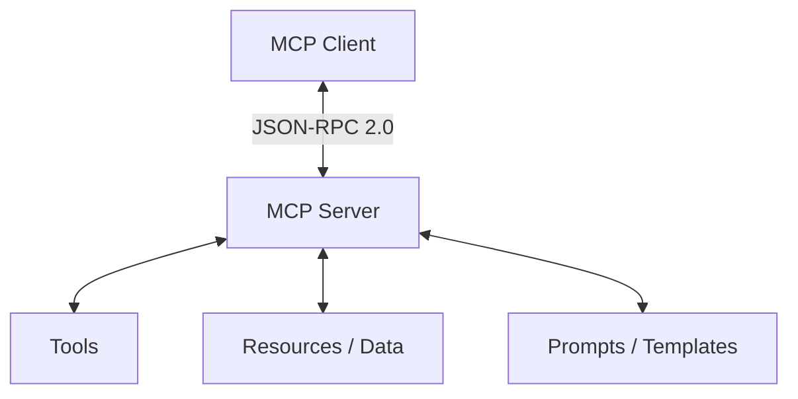

# Model Context Protocol (MCP)

An open standard for connecting AI models to data sources and tools securely.

## Overview

The Model Context Protocol (MCP) defines a standard way for client applications (like AI assistants and IDEs) to discover and interact with external data sources, tools, and prompts. It allows developers to build reusable integrations that work across different LLM platforms.

## Architecture

MCP operates on a client-server architecture:
- **Clients**: Applications like Claude Desktop, IDE extensions, or agent hosts that interact with models.
- **Servers**: Services that expose tools, resources (data), and prompts to the clients.
- **Transport**: Standard JSON-RPC 2.0 communication over Stdio or SSE (Server-Sent Events).

## Getting Started

1. **Prerequisites**: Node.js or Python installed on your system.
2. **Implementation**: Build your first MCP server by implementing the protocol handlers for resource listing, tool execution, or prompt retrieval.

For more details, refer to the [official MCP documentation](https://modelcontextprotocol.io).
